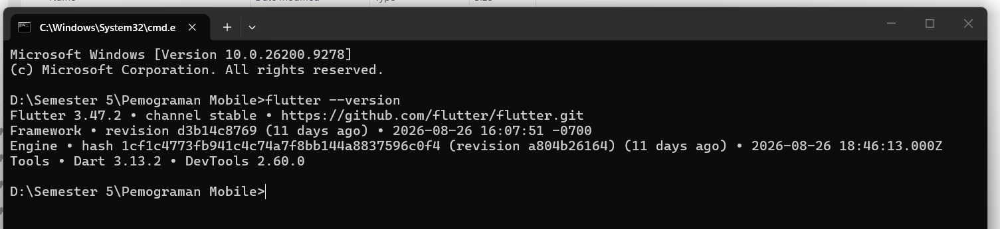
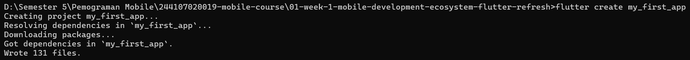
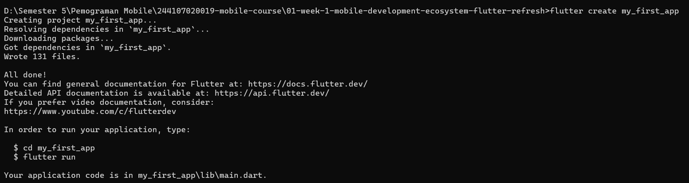
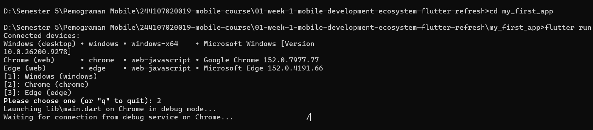
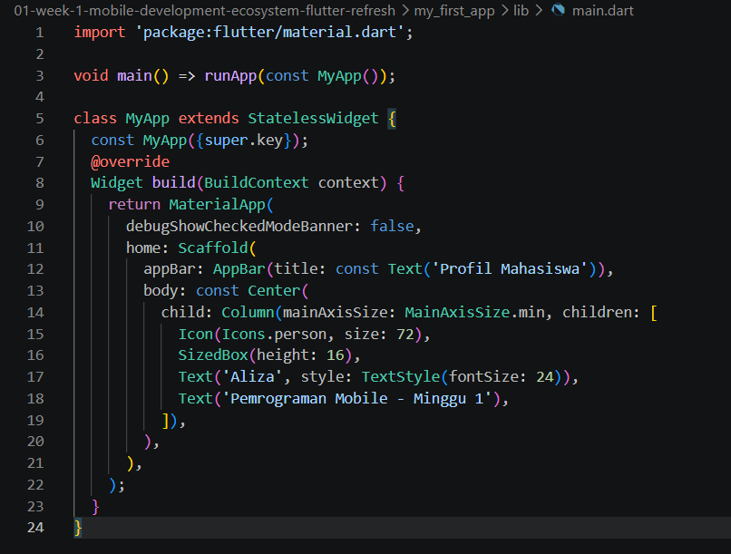
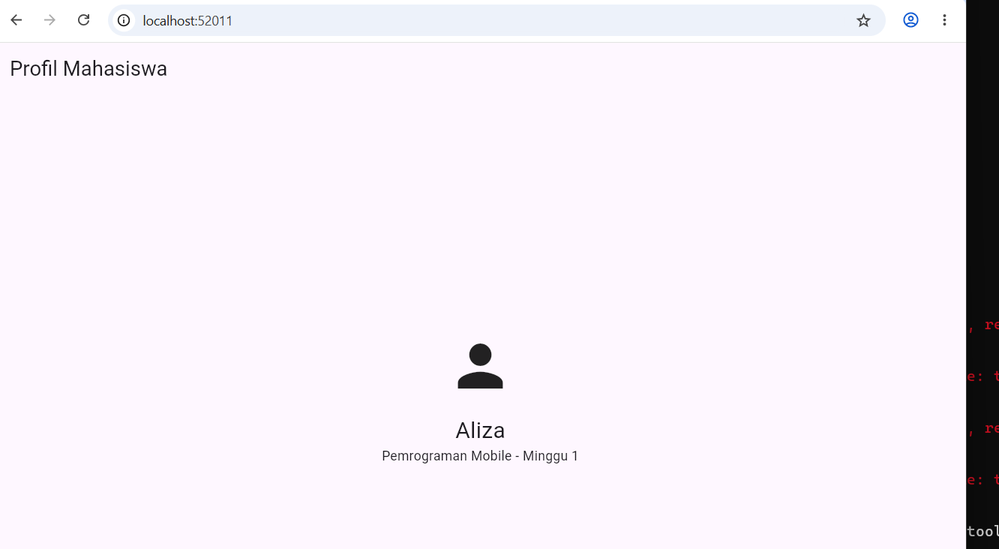
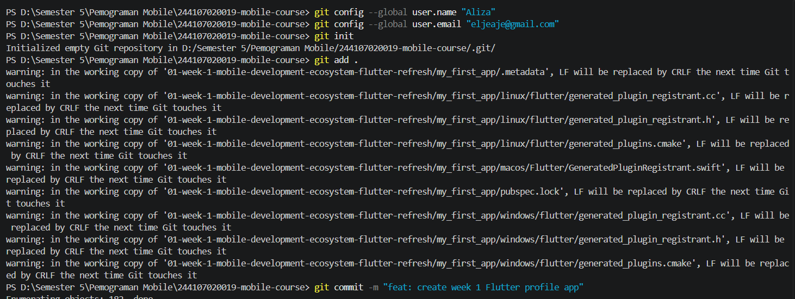
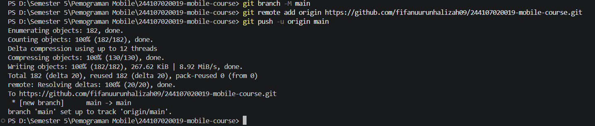
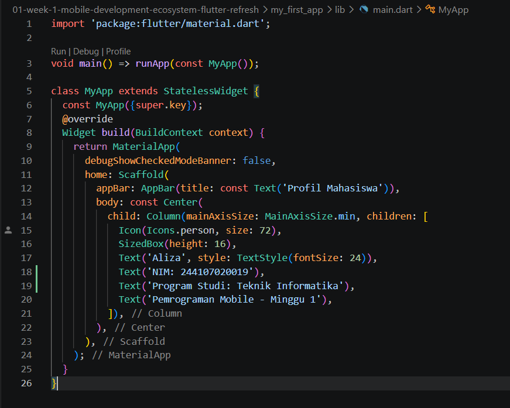
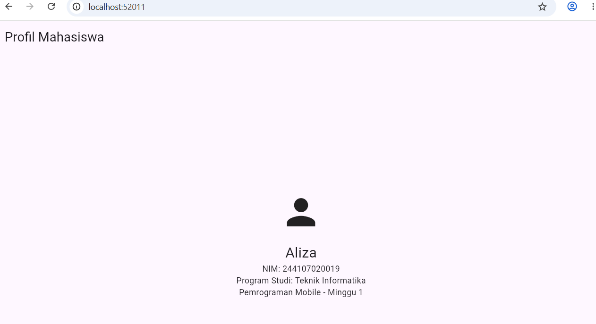

## Jobsheet 1

*Nama:* Fifa Nuurun Halizah  
*NIM:* 244107020019  
*Kelas:* TI-3E  

### LAPORAN PRAKTIKUM WEEK01

<h3>JOBSHEET 1</h3>

<blockquote>

### Langkah Praktikum :

Membuat dan menjalankan proyek Flutter

Buka terminal pada folder kerja, lalu jalankan:

### Mengubah UI Default

### Hasil

### Git dan Portfolio

### Mini Assignment

### Hasil Mini Assignment

### Refleksi

**1. Kapan native lebih tepat dipilih daripada cross-platform?**

Native lebih tepat dipilih ketika aplikasi membutuhkan performa tinggi, akses mendalam terhadap fitur perangkat, atau integrasi khusus dengan sistem operasi tertentu.

**2. Bagaimana perubahan state berhubungan dengan widget tree dan UI deklaratif?**

Pada Flutter, perubahan state dapat menyebabkan widget tree dibangun kembali sehingga tampilan UI menyesuaikan dengan kondisi terbaru. Dengan pendekatan UI deklaratif, developer menentukan tampilan berdasarkan state saat ini, kemudian Flutter akan memperbarui tampilan sesuai perubahan state tersebut.

**3. Mengapa commit kecil dengan pesan jelas bermanfaat bagi pekerjaan tim dan portfolio?**

Commit kecil dengan pesan yang jelas membuat perubahan kode lebih mudah dipahami, dilacak, dan diperbaiki oleh anggota tim. Riwayat commit yang rapi juga menunjukkan proses pengembangan yang terstruktur sehingga dapat menjadi nilai tambah dalam portfolio karena memperlihatkan kemampuan menggunakan Git dengan baik.

</blockquote>

