## Jobsheet 2

*Nama:* Fifa Nuurun Halizah 
*NIM:* 244107020019 
*Kelas:* TI-3E 

## Langkah-langkah beserta bukti Screenshoot:
### LAPORAN PRAKTIKUM WEEK02

<h3>JOBSHEET 2</h3>

<blockquote>

### Langkah Praktikum :

## Praktikum: layout sederhana (warm-up) 

Pada tahap awal dilakukan latihan menggunakan widget dasar Flutter untuk memahami penyusunan layout sebelum membuat dashboard responsif.

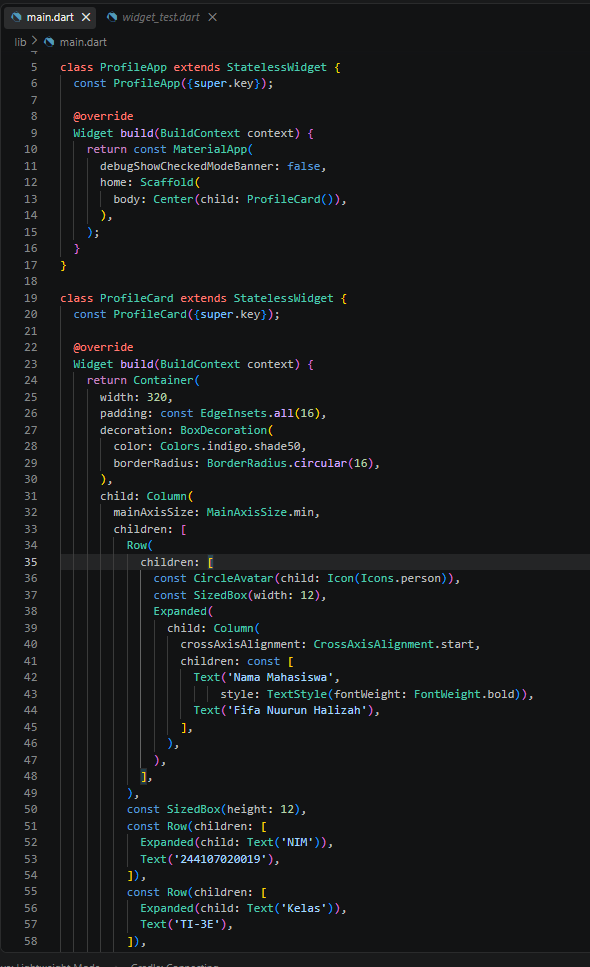
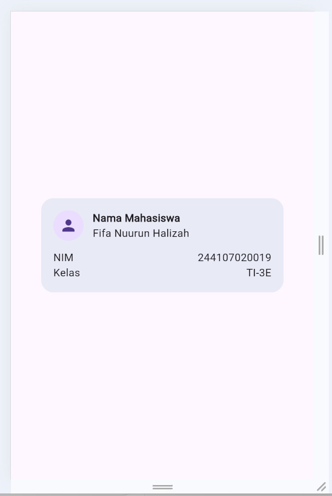
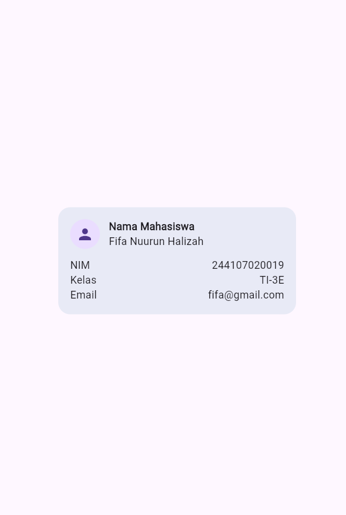

## Praktikum: dashboard responsif

# Menyiapkan project

Project yang digunakan adalah `responsive_dashboard`. Project dibuat dan dijalankan menggunakan Flutter.

# Menambahkan interaksi: StatefulWidget dan Cupertino  

DashboardApp diubah dari `StatelessWidget` menjadi `StatefulWidget`. Pada bagian AppBar ditambahkan `CupertinoSwitch` untuk mengatur perpindahan antara tema terang dan tema gelap.

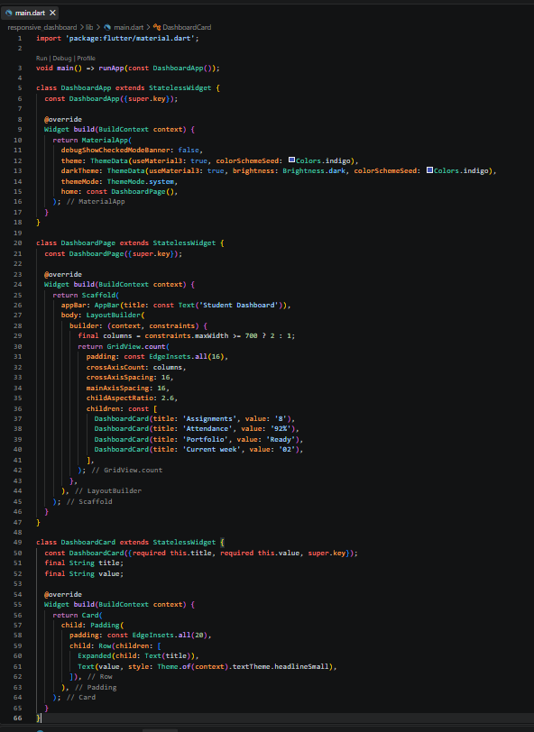
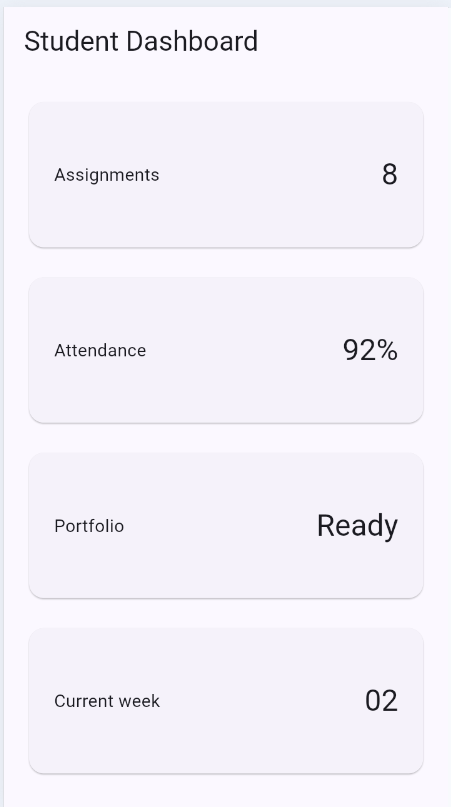
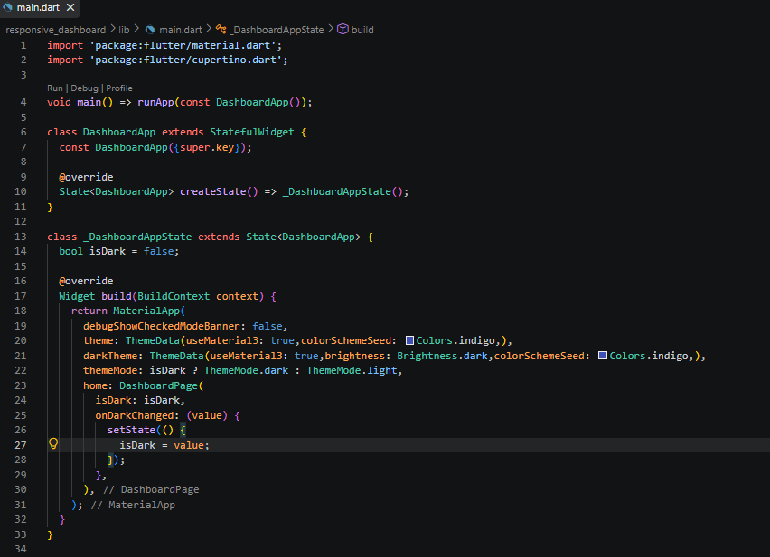
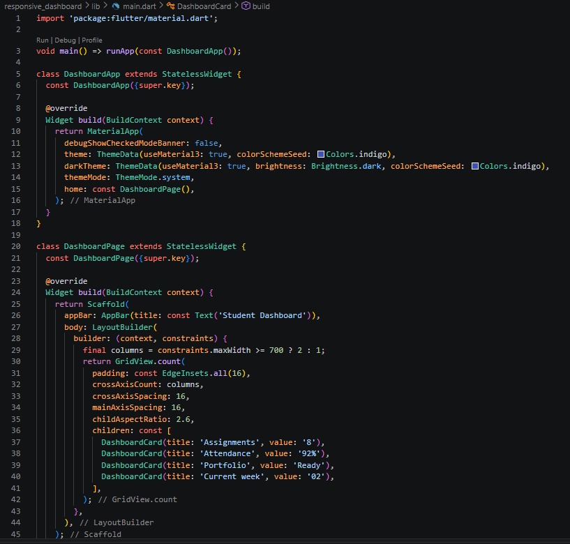
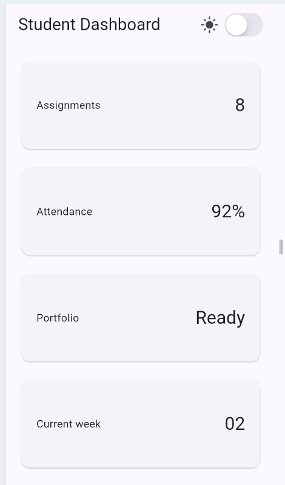
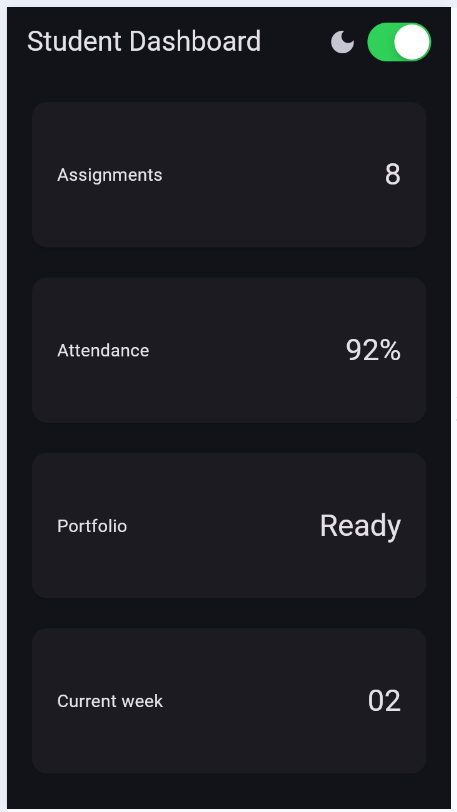

# Eksperimen layout

1. Breakpoint digunakan untuk menentukan jumlah kolom berdasarkan lebar layar. Pada kode yang digunakan, jika lebar layar mencapai 700 pixel atau lebih maka dashboard menggunakan 2 kolom. Jika kurang dari 700 pixel maka menggunakan 1 kolom.

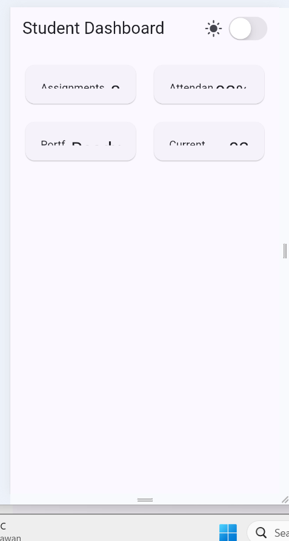

2. Theme digunakan untuk memberikan tampilan light mode dan dark mode. Perpindahan tema dilakukan menggunakan `CupertinoSwitch`.

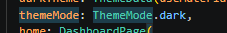

3. Aplikasi diuji menggunakan ukuran layar yang berbeda untuk melihat apakah layout dapat menyesuaikan ukuran layar.

4. Ditambahkan `Semantics` pada bagian switch tema dan kartu informasi agar elemen penting memiliki label yang bermakna bagi screen reader.

Secara visual tidak terdapat perubahan besar pada tampilan, tetapi `Semantics` memberikan informasi tambahan yang dapat digunakan oleh screen reader.

## TUGAS UTAMA
1. Memiliki header profil dan minimal empat kartu informasi.
2. Menggunakan Row, Column, Expanded, dan Container.
3. Menampilkan satu kolom pada layar sempit dan dua kolom pada layar lebar.
4. Menyediakan light theme dan dark theme yang tetap terbaca, dengan toggle tema (misal CupertinoSwitch atau Switch.adaptive).
5. Memiliki label aksesibilitas untuk informasi atau tombol penting.
6. Screenshots
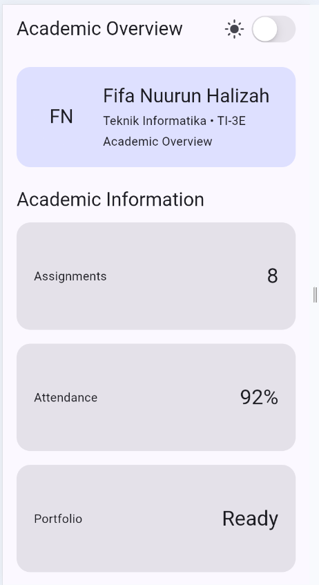
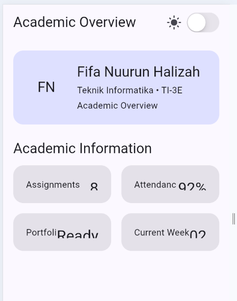
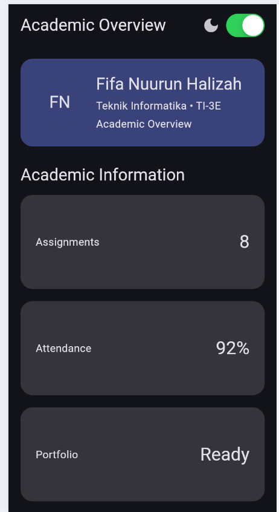

## AI Prompt Challenge

### 1. Prompt desain

Prompt:
> "Bandingkan dua tata letak dashboard akademik untuk Flutter: versi GridView dan versi LayoutBuilder + Column. Jelaskan kelebihan dan kekurangannya."

**Jawaban AI:**
GridView lebih sederhana untuk membuat kumpulan kartu, sedangkan LayoutBuilder + Column lebih fleksibel untuk menggabungkan header dan kartu serta menyesuaikan tampilan berdasarkan ukuran layar.

**Keputusan Saya:**
Saya memilih LayoutBuilder + Column.

**Alasan:**
Karena dashboard saya memiliki bagian profil di atas dan kartu informasi di bawahnya, sehingga LayoutBuilder + Column lebih fleksibel.

### 2. Prompt penguatan konsep

Prompt:
> "Jelaskan kapan Expanded dapat menyebabkan layout error di dalam Row dan bagaimana cara mengatasinya."

**Jawaban AI:**
Expanded dapat menyebabkan error jika digunakan pada parent yang tidak memiliki batas ukuran yang jelas. Salah satu solusinya adalah menggunakan Flexible atau memberikan batas ukuran pada parent.

**Keputusan Saya:**
Saya tetap menggunakan Expanded pada bagian yang memiliki batas ukuran yang jelas.

### 3. Verification prompt

Prompt:
> "Periksa apakah layout tetap responsif di bawah 600px, aksesibilitas tetap baik, dan widget yang digunakan tersedia di Flutter stable."

**Jawaban AI:**
Layout tetap responsif karena menggunakan LayoutBuilder dan breakpoint. Aksesibilitas dibantu dengan Semantics, dan widget yang digunakan merupakan widget Flutter yang tersedia.

**Verifikasi Saya:**
Saya menjalankan `flutter analyze` dan melakukan widget test untuk memeriksa responsive layout.

## Refactoring challenge

1. Kartu informasi dibuat menjadi widget reusable bernama `DashboardCard` yang menerima `title` dan `value`. Dengan cara ini kode untuk setiap kartu tidak perlu dibuat secara berulang.

2. Warna kartu menggunakan `Theme.of(context).colorScheme.surfaceContainerHighest`, sehingga warna dapat menyesuaikan dengan theme yang sedang digunakan.

3. Pada layout digunakan breakpoint `700` pixel untuk menentukan jumlah kolom pada `GridView`.

4. Jalankan perintah berikut untuk melakukan pengecekan kode:

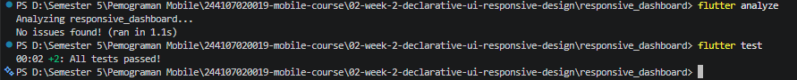

## Refleksi

- Apa perbedaan cara berpikir imperative dan declarative saat membangun UI?

Cara berpikir imperative berfokus pada langkah-langkah untuk mengubah tampilan UI. Sedangkan declarative berfokus pada tampilan yang ingin dihasilkan berdasarkan kondisi tertentu. Flutter menggunakan pendekatan declarative, sehingga UI dibuat dengan menyusun widget sesuai tampilan yang diinginkan.

- Kapan `Expanded` membantu dan kapan penggunaannya justru menghasilkan layout error?

`Expanded` membantu ketika ingin membuat widget mengisi ruang yang tersedia di dalam `Row` atau `Column`. Namun, `Expanded` dapat menyebabkan layout error jika digunakan pada parent yang tidak memiliki batas ukuran yang jelas atau memiliki `unbounded constraints`.

- Bagaimana breakpoint dan theme memengaruhi pengalaman pengguna?

Breakpoint membuat tampilan menyesuaikan ukuran layar. Pada aplikasi ini, layar di bawah 700 pixel menggunakan 1 kolom, sedangkan layar 700 pixel atau lebih menggunakan 2 kolom. Theme memberikan pilihan light mode dan dark mode sehingga pengguna dapat memilih tampilan yang lebih nyaman.

- Apa yang Anda verifikasi dari rekomendasi AI setelah tugas inti selesai?

Saya memverifikasi rekomendasi AI dengan membandingkan `GridView` dan `LayoutBuilder + Column`, mengecek penggunaan `Expanded`, serta memastikan layout tetap responsif dan memiliki `Semantics`. Saya juga menjalankan `flutter analyze` untuk memastikan tidak ada masalah pada kode.