# Jobsheet 3 – Navigation dan State Management

**Nama:** Fifa Nuurun Halizah
**NIM:** 244107020019
**Kelas:** TI-3E

---

## 1. Konsep Navigasi dan GoRouter

Pada Jobsheet 3 dipelajari konsep navigasi pada Flutter menggunakan `Navigator` dan `GoRouter`.

`Navigator` digunakan untuk berpindah halaman dengan metode seperti `Navigator.push()` dan `Navigator.pop()`.

Sedangkan `GoRouter` digunakan untuk membuat navigasi berdasarkan URL atau path. Beberapa fitur yang digunakan yaitu:

* `GoRoute` untuk menentukan route.
* `context.go()` untuk berpindah ke route tertentu.
* `context.push()` untuk menambahkan halaman ke navigation stack.
* `state.pathParameters` untuk mengambil parameter dari path.
* `extra` untuk mengirim data tambahan.
* `redirect` untuk mengatur pengalihan route.

Pada praktikum ini digunakan `GoRouter` untuk membuat halaman Home dan Detail.

---

## 2. Praktikum 1 – GoRouter

### Tujuan

Membuat navigasi antarhalaman menggunakan `GoRouter` dan memahami penggunaan path parameter.

### Implementasi

Project yang digunakan adalah `week3_navigation`.

Struktur utama project:

```text
week3_navigation/
├── lib/
│   ├── pages/
│   │   ├── detail_page.dart
│   │   └── home_page.dart
│   └── main.dart
├── test/
└── pubspec.yaml
```

### Hasil Praktikum

Pada halaman Home terdapat daftar item yang dapat dipilih.

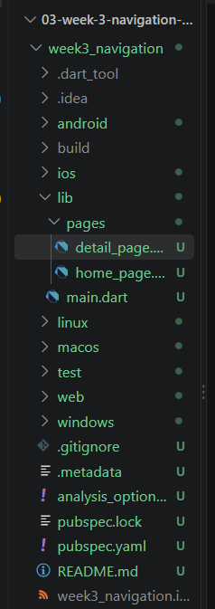

*Gambar 1. Struktur project `week3_navigation`.*

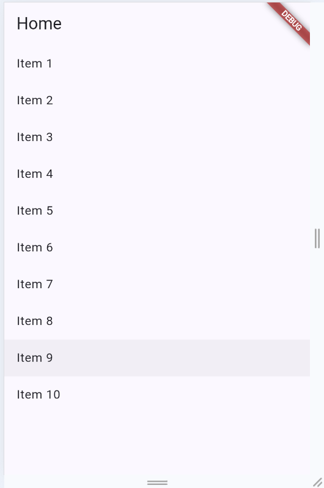

*Gambar 2. Halaman Home dengan daftar item.*

Ketika salah satu item dipilih, aplikasi berpindah ke halaman Detail menggunakan route dengan parameter ID.

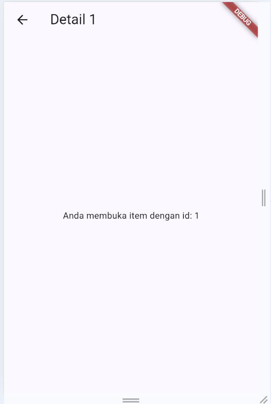

*Gambar 3. Halaman Detail dengan ID 1.*

Pengujian juga dilakukan dengan membuka path detail secara langsung.

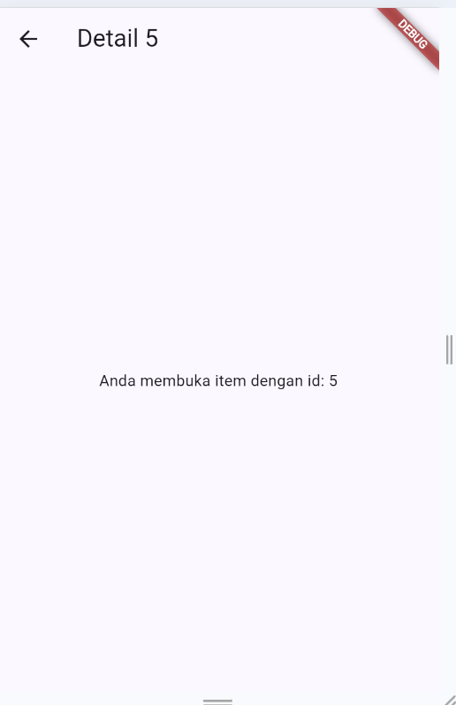

*Gambar 4. Pengujian direct path pada halaman Detail.*

Dari praktikum ini dapat dilihat bahwa `GoRouter` dapat digunakan untuk mengatur perpindahan halaman berdasarkan route yang telah ditentukan.

---

## 3. Praktikum 2 – Riverpod

### Tujuan

Mempelajari pengelolaan state menggunakan Riverpod dengan `ProviderScope`, `Notifier`, `NotifierProvider`, `ConsumerWidget`, `ref.watch`, dan `ref.read`.

Project yang digunakan adalah `week3_todo`.

Struktur project:

```text
week3_todo/
├── lib/
│   ├── pages/
│   │   ├── product_page.dart
│   │   ├── stats_page.dart
│   │   └── todo_page.dart
│   ├── providers/
│   │   ├── product_provider.dart
│   │   └── todo_provider.dart
│   ├── widgets/
│   │   └── todo_tile.dart
│   └── main.dart
├── test/
└── pubspec.yaml
```

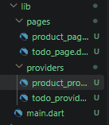

*Gambar 5. Struktur project `week3_todo`.*

Aplikasi ToDo menggunakan Riverpod untuk menyimpan dan mengubah daftar tugas.

Ketika belum terdapat tugas, aplikasi menampilkan pesan bahwa belum ada tugas.

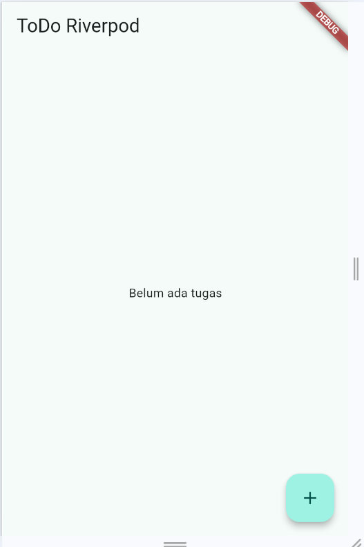

*Gambar 6. Tampilan awal ToDo ketika belum ada tugas.*

Untuk menambahkan tugas, tombol `+` digunakan dan akan menampilkan dialog input.

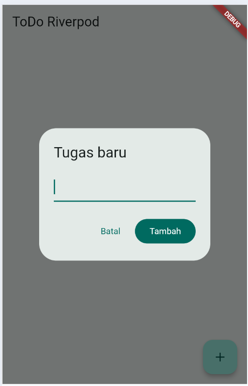

*Gambar 7. Dialog untuk menambahkan tugas baru.*

Setelah tugas ditambahkan, tugas akan ditampilkan pada daftar dan dapat ditandai sebagai selesai menggunakan checkbox.

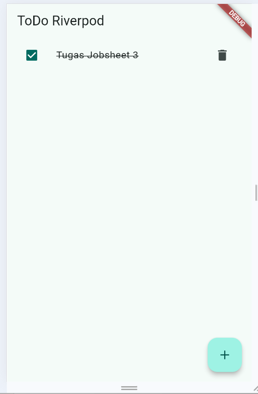

*Gambar 8. Tugas berhasil ditambahkan dan ditandai selesai.*

State ToDo dikelola oleh `TodoListNotifier`, sehingga perubahan data dilakukan melalui provider.

---

## 4. Praktikum 3 – AsyncValue

### Tujuan

Mempelajari penggunaan `AsyncValue` untuk menangani proses asynchronous dengan tiga kondisi utama:

* `loading`
* `error`
* `data/success`

Pada praktikum ini digunakan project `week3_async`.

Provider melakukan simulasi pengambilan data dengan `Future.delayed()` sehingga terdapat waktu tunggu sebelum data ditampilkan.

### Kondisi Loading

Saat data sedang diproses, aplikasi menampilkan `CircularProgressIndicator`.

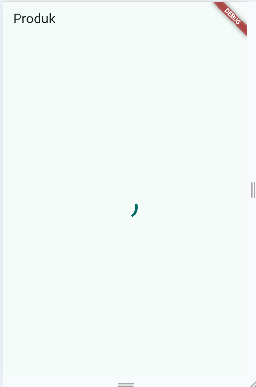

*Gambar 9. Kondisi loading pada halaman Produk.*

### Kondisi Success

Setelah proses selesai, data produk ditampilkan pada `ListView`.

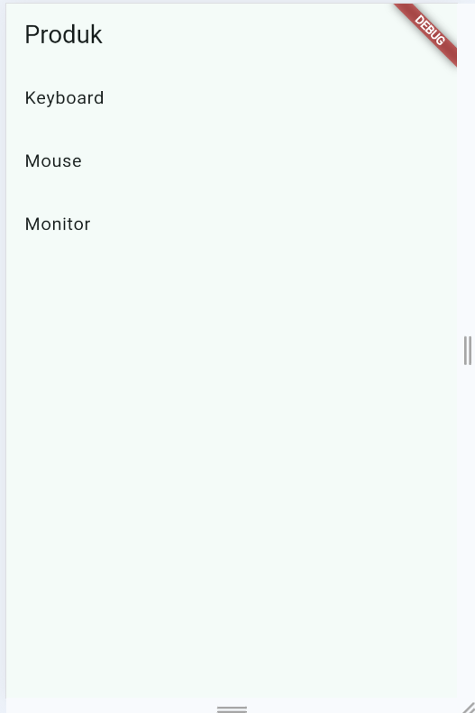

*Gambar 10. Kondisi success pada halaman Produk.*

### Kondisi Error

Jika terjadi kesalahan saat mengambil data, aplikasi menampilkan pesan error dan tombol `Coba lagi`.

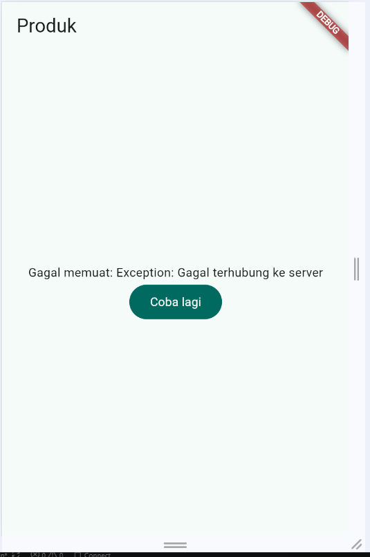

*Gambar 11. Kondisi error pada halaman Produk.*

Penggunaan `AsyncValue` membuat state asynchronous lebih mudah dikelola karena kondisi loading, error, dan success ditangani dalam satu state.

---

## 5. AI Challenge

### Prompt yang Digunakan

Pada bagian AI Challenge digunakan prompt berikut:

```text
Buatkan halaman Flutter bernama StatsPage menggunakan flutter_riverpod.
Requirements:
- ConsumerWidget dengan satu AsyncNotifierProvider yang mensimulasikan
  pengambilan data statistik (delay 2 detik, kadang gagal 30%).
- UI harus menangani loading (spinner), error (pesan + tombol retry),
  dan success (ListView 3 item).
- Berikan unit test untuk notifier-nya.
Jelaskan setiap bagian kode dalam komentar.
```

### Hasil Awal AI

AI menghasilkan:

* `StatsNotifier` menggunakan `AsyncNotifier`.
* `statsProvider` menggunakan `AsyncNotifierProvider`.
* `StatsPage` menggunakan `ConsumerWidget`.
* Kondisi loading, error, dan success menggunakan `AsyncValue.when()`.
* Tombol retry untuk mengambil data kembali.
* Unit test untuk memeriksa data statistik.

### Verifikasi dan Perbaikan

Hasil dari AI kemudian diperiksa dan dilakukan beberapa perbaikan.

Perbaikan yang dilakukan yaitu:

1. Logika pengambilan data dipisahkan ke method `_fetchStats()` agar lebih rapi.
2. Method `retry()` menggunakan `AsyncValue.guard()` untuk menangani hasil proses asynchronous.
3. Unit test menggunakan `TestStatsNotifier` agar hasil pengujian tidak bergantung pada nilai random.
4. Widget test menggunakan `ProviderScope` dan melakukan override provider.
5. Pengujian dilakukan untuk memastikan tiga data statistik dapat ditampilkan.

### Hasil AI Challenge

Pada halaman Statistik terdapat kondisi loading ketika data sedang diambil.

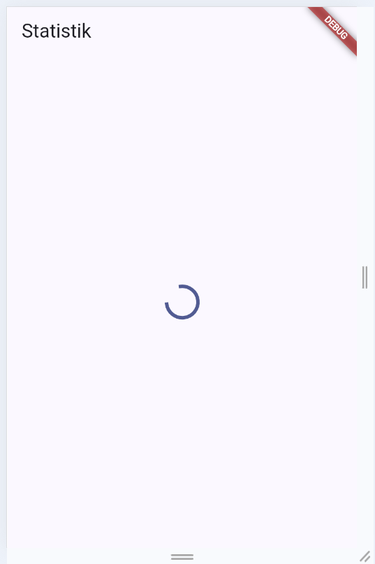

*Gambar 12. Kondisi loading pada StatsPage.*

Setelah proses berhasil, tiga data statistik ditampilkan.

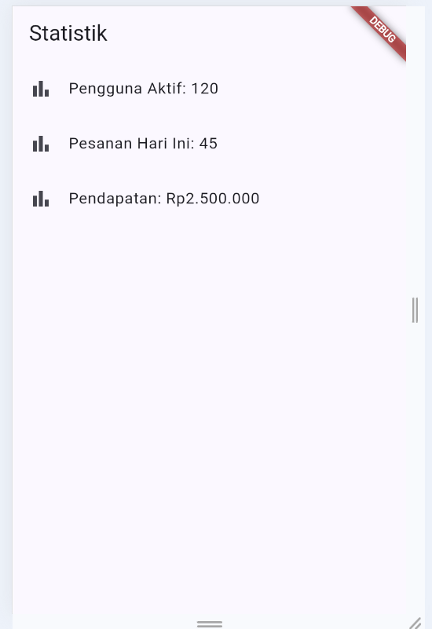

*Gambar 13. Kondisi success pada StatsPage.*

Pengujian kondisi loading kembali dilakukan untuk memastikan UI dapat menampilkan indikator proses.

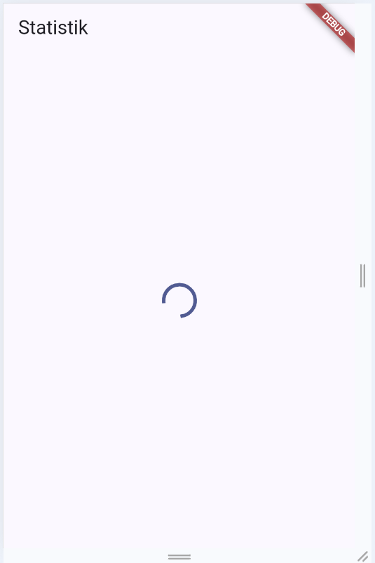

*Gambar 14. Tampilan loading StatsPage.*

Ketika data berhasil diambil, data statistik ditampilkan kembali.

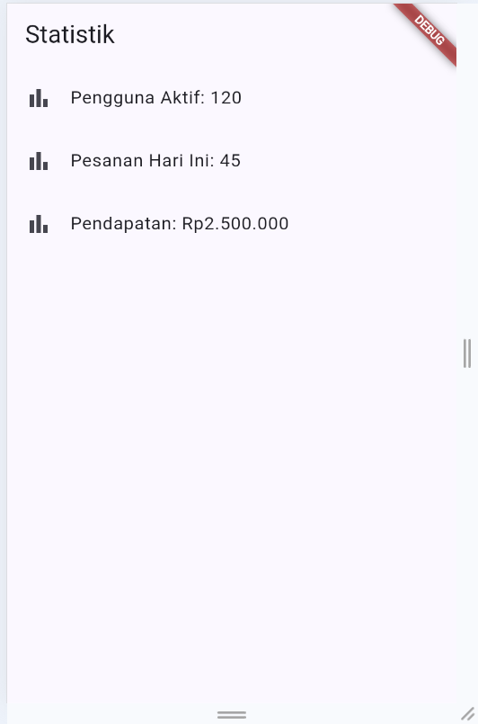

*Gambar 15. Data statistik berhasil ditampilkan.*

Dari AI Challenge ini dapat dipahami bahwa hasil dari AI tetap perlu diperiksa dan diuji sebelum digunakan dalam project.

---

## 6. Refactoring dan Testing

### Refactoring

Pada bagian refactoring dilakukan beberapa perubahan pada aplikasi ToDo.

#### 1. Memisahkan TodoTile

Widget daftar tugas yang sebelumnya berada langsung di dalam `TodoPage` dipisahkan menjadi widget:

```text
lib/widgets/todo_tile.dart
```

`TodoTile` bertanggung jawab untuk menampilkan satu item tugas, termasuk:

* Checkbox tugas.
* Judul tugas.
* Status selesai.
* Tombol hapus.

Dengan pemisahan ini, kode `TodoPage` menjadi lebih pendek dan lebih mudah diuji.

#### 2. Membuat Provider Filter

Ditambahkan provider untuk mendapatkan daftar tugas yang belum selesai:

```dart
final incompleteTodoProvider = Provider<List<Todo>>((ref) {
  final todos = ref.watch(todoListProvider);
  return todos.where((todo) => !todo.done).toList();
});
```

Provider tersebut membaca `todoListProvider` dan menghasilkan daftar tugas yang belum selesai.

#### 3. Integrasi GoRouter

Aplikasi ToDo juga diintegrasikan dengan `GoRouter`.

Route utama:

```text
/       → halaman ToDo
/stats  → halaman Statistik
```

Navigasi antarhalaman menggunakan `NavigationBar`.

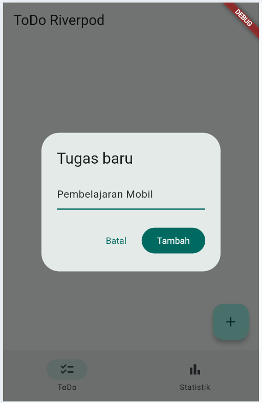

*Gambar 16. Halaman ToDo dan NavigationBar.*

Halaman Statistik dapat dibuka melalui menu pada bagian bawah aplikasi.

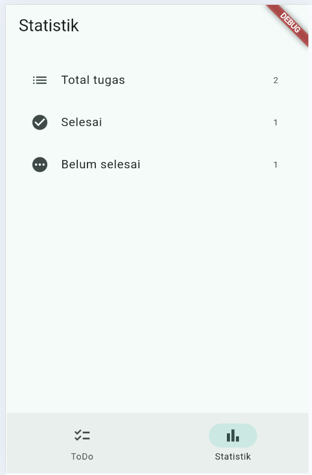

*Gambar 17. Halaman Statistik pada aplikasi ToDo.*

State ToDo tetap dikelola menggunakan Riverpod ketika berpindah halaman.

### Testing

Widget test digunakan untuk menguji proses penambahan tugas baru.

Pengujian dilakukan dengan langkah:

1. Menjalankan `MyApp`.
2. Memastikan teks `Belum ada tugas` muncul.
3. Menekan tombol tambah.
4. Mengisi nama tugas.
5. Menekan tombol `Tambah`.
6. Memastikan tugas berhasil muncul pada halaman.

Perintah yang digunakan:

```bash
flutter analyze
flutter test
```

Hasil pengujian menunjukkan proses testing dapat dijalankan pada project.

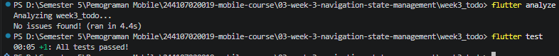

*Gambar 18. Hasil pengujian project.*

---

## 7. Tugas, Refleksi, dan Referensi

### Mini Project / Industry Challenge

Mini project yang dibuat adalah aplikasi ToDo menggunakan Flutter dengan Riverpod dan GoRouter.

Fitur utama yang dibuat:

* Daftar tugas.
* Menambahkan tugas.
* Menandai tugas sebagai selesai.
* Menghapus tugas.
* Halaman Statistik.
* Navigasi menggunakan GoRouter.
* State management menggunakan Riverpod.
* Simulasi asynchronous menggunakan AsyncValue.
* Loading, error, dan success state.
* Unit/widget test.

### Stack Teknologi

Teknologi yang digunakan:

* Flutter
* Dart
* Riverpod
* GoRouter
* AsyncValue
* Flutter Test

### Cara Menjalankan Project

Masuk ke folder project yang ingin dijalankan, kemudian jalankan:

```bash
flutter pub get
flutter run
```

Untuk melakukan pengecekan kode:

```bash
flutter analyze
```

Untuk menjalankan testing:

```bash
flutter test
```

### Refleksi

#### 1. Kapan `setState` masih cukup, dan kapan state harus naik ke Riverpod?

`setState` masih cukup digunakan untuk state sederhana yang hanya digunakan oleh satu widget, misalnya membuka atau menutup tampilan tertentu.

Riverpod lebih cocok ketika state digunakan oleh beberapa widget atau beberapa halaman dan perlu dikelola secara terpusat. Pada aplikasi ToDo, Riverpod digunakan agar data tugas dapat dikelola melalui provider dan tetap tersedia ketika berpindah halaman.

#### 2. Apa perbedaan `context.go()` dan `context.push()`?

`context.go()` digunakan untuk berpindah ke route tertentu dan mengganti lokasi route saat ini.

Sedangkan `context.push()` menambahkan route baru ke navigation stack. Karena route sebelumnya masih berada di stack, pengguna dapat kembali ke halaman sebelumnya.

#### 3. Bagaimana `AsyncValue` mencegah bug dibanding menggunakan tiga boolean?

`AsyncValue` menyatukan kondisi asynchronous ke dalam satu state, yaitu loading, error, atau data.

Jika menggunakan beberapa boolean seperti `isLoading`, `isError`, dan `hasData`, dapat terjadi kondisi yang tidak sesuai, misalnya lebih dari satu kondisi bernilai `true`.

Dengan `AsyncValue`, kondisi tersebut ditangani menggunakan state yang lebih terstruktur sehingga UI lebih mudah dibuat dan dikelola.

#### 4. Bagian AI mana yang diperbaiki dan mengapa?

Bagian AI yang diperbaiki terutama adalah logika pengambilan data dan testing.

Method `_fetchStats()` dipisahkan agar kode lebih terstruktur. Pada testing, digunakan `TestStatsNotifier` agar hasil test tidak bergantung pada proses random 30% gagal. Dengan cara tersebut, test dapat memberikan hasil yang lebih konsisten.

Widget test juga diperbaiki dengan menggunakan `ProviderScope` dan override provider sehingga `StatsPage` dapat diuji dengan data yang sudah ditentukan.

### Hasil yang Dicapai

Setelah menyelesaikan Jobsheet 3, aplikasi berhasil menerapkan:

* Navigasi menggunakan GoRouter.
* State management menggunakan Riverpod.
* `ConsumerWidget`, `Notifier`, dan `Provider`.
* Pemrosesan asynchronous menggunakan `AsyncValue`.
* Penanganan loading, error, dan success.
* Refactoring widget menjadi `TodoTile`.
* Provider untuk filter data.
* NavigationBar untuk berpindah halaman.
* Widget/unit testing.
* Verifikasi hasil kode yang dibuat dengan bantuan AI.

### Referensi

* Flutter Documentation
* Riverpod Documentation
* GoRouter Documentation
* Flutter Testing Documentation
